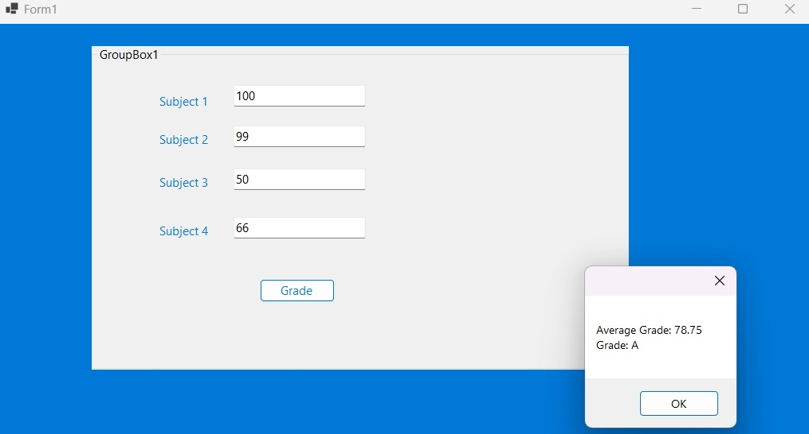

# Repo For Visual Basics Assignments and Projects 

## Name: Theuri Bonface Karue 
## Reg_No: SCT211-0573/2022

## There are several assignments in this repo 
* The first being on a welcoming form you can access it using the link below

* The second one being on a Grade Calculator which can be easily accessed using the link below
For the second assignment I have taken the privilege of adding some images to give a glimpse of the work I've done   

* For the GUI Design 

* For the Demo

